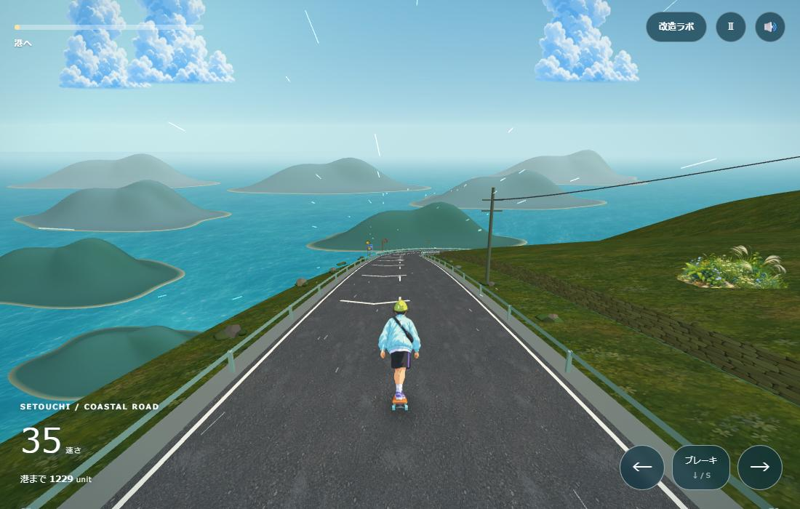

# 豊島ダウンヒル 🛹

瀬戸内の島々を見おろす坂から、海辺の港へ。香川県・豊島の風景をモチーフにした、ブラウザで遊べるスケートボードゲームです。
**CoderDojoでは、数字をひとつ変えるところからゲームづくりを体験できます。**

[公開版で遊ぶ](https://tsubasagit.github.io/teshima-downhill/) · [改造の教材を読む](docs/CODERDOJO.md) · [設定ファイルを開く](settings.js)

> 公開版は GitHub Pages に最後に反映された版です。ローカルで変更した内容は、リポジトリへ反映するまで公開版には出ません。



## あそびかた

| やりたいこと | キーボード | スマホ・マウス |
|---|---|---|
| 左右に曲がる | ← → または A / D を押し続ける | 左右ボタンを長押し、または景色を押したまま指を左右へ動かす |
| ゆっくり走る | ↓ または S を押し続ける | ブレーキボタンを長押し |
| 一時停止・再開 | スペース / Esc | 右上の Ⅱ ボタン |
| 速さを実験する | 「改造ラボ」を選ぶ | 右上の「改造ラボ」を押す |

- 自動で前進します。手を離すと横すべりがゆっくり止まります。
- 景色を楽しむモードです。障害物・レモン・スコア・ライフ制はありません。
- 港に着いたらゴール。次の周は少し速くなります。
- 別のタブやアプリへ切り替えると、自動で一時停止します。
- 「速さ」はゲーム内ユニット/秒、残り距離はゲーム内ユニットです。実測の km/h・m ではありません。

## まずは数字ひとつ

[settings.js](settings.js) の最初にある `speed` を変えて保存し、ブラウザを更新します。

```js
speed: 36, // 24ならゆっくり、54なら速い！
```

人物は1枚の絵を連続的に変形させるため、左右操作で画像が薄くなりません。`riderLean` で体の傾きの大きさを調整できます。

画面の「改造ラボ」でも、速さ・曲がる力・カメラのゆれを試せます。ラボを開くと一時停止し、閉じると元の状態に戻ります。**ラボの変更は一時的**です。気に入った数字は `settings.js` の同じ名前の行へ書いて残しましょう。

## どう動いているの？

```text
入力（キー・指）
  ↓
physics.js：速さと位置を計算する
  ↓
game.js：道の上に人とカメラを置く
  ↓
three.js：3Dの景色を描く → 次のフレームへ
```

基本は **進む距離 = 速さ × 経過した秒数**。36の速さで0.5秒進むと18ユニット進みます。発進時には目標の速さへ少しずつ近づけ、体とカメラの動きも滑らかにつなぎます。

具体的な改造例、実験の順番、メンター向けの45〜60分の進行案は **[CoderDojo教材](docs/CODERDOJO.md)** にまとめています。

## 自分のパソコンで動かす

公開版を遊ぶだけならブラウザだけでOK。コードを改造するときは、エディタとローカルサーバーが必要です。

1. リポジトリの **Code → Download ZIP** からダウンロードし、展開する。
2. **Python 3 が使えるPC**で、Windowsなら `start-game.cmd` をダブルクリックする。
3. [ローカルのゲーム](http://127.0.0.1:8940/index.html) を開く。
4. `settings.js` をエディタで開く → 数字を変える → 保存 → ブラウザを更新。

Mac / Linuxの場合は、このフォルダで以下を実行します。

```sh
python3 -m http.server 8940 --bind 127.0.0.1
```

Windowsのターミナルなら `python -m http.server 8940 --bind 127.0.0.1` でも起動できます。

`index.html` の直接ダブルクリック（`file://`）では画像を読み込めません。上記のサーバーから開いてください。three.js r128をCDNから読み込むため、インターネット接続も必要です。npmやビルドは不要です。

## ファイルの案内

| ファイル | 役割 |
|---|---|
| [settings.js](settings.js) | ★最初に改造する場所。速さ・操作感・カメラ・コース |
| [physics.js](physics.js) | 前進・横移動・摩擦・ブレーキ・道の端の計算 |
| [game.js](game.js) | 道・島・海・空・プレイヤーの描画、入力、ゲームループ |
| [index.html](index.html) | スタート画面、操作ボタン、改造ラボ |
| [styles.css](styles.css) | 画面の色・文字・配置 |
| [assets/](assets/) | キャラクターや沿道の画像。説明は [assets/README.md](assets/README.md) |
| [docs/CODERDOJO.md](docs/CODERDOJO.md) | 子ども向けの実験と、メンター用の説明 |
| [tests/physics.test.cjs](tests/physics.test.cjs) | 速さ、ブレーキ、道幅、fps差の自動チェック |

ブラウザの自動確認スクリプトは `tools/verify-browser.cjs` です。Playwrightと対応ブラウザがある開発環境で、ローカルサーバー起動後に `node tools/verify-browser.cjs` を実行します。必要に応じて `GAME_URL`、`BROWSER_CHANNEL`、`PLAYWRIGHT_MODULE`、`CAPTURE_DIR` を環境変数で指定できます。Playwrightはゲームの実行には不要です。`node tools/verify-rider.cjs` ではGPU上で人物を240フレーム描画し、左右切替で不透明さが落ちないことと、足元が固定されていることも検証します。

`node tools/verify-coast.cjs` は、海と岸の前後判定をGPUで検証します。PC・スマホの画角で視点を少しずつ変え、高精度の参照描画と比べて波打ち際のちらつきを調べます。

## 風景について

豊島・唐櫃の坂と瀬戸内海をモチーフに、海側の斜面、島々の重なり、落ち着いた空と水面を組み合わせています。遊びやすさと景色の見やすさを優先した**演出上のコース**であり、実際の距離・標高・島の配置の正確な再現ではありません。

以前の現地参照資料は [参照正本_唐櫃の坂.md](参照正本_唐櫃の坂.md)、設計メモは [指示書_豊島再現と没入感.md](指示書_豊島再現と没入感.md) に残しています。

## 開発時の確認

Node.jsがある場合、追加パッケージなしで計算部分を確認できます。

```sh
node --check settings.js
node --check physics.js
node --check game.js
node --test tests/physics.test.cjs
```

ブラウザでは、発進 → 左右 → ブレーキ → 一時停止 → ラボ → ゴール → 次の周を確認してください。スマホの縦横画面でも、指を離した後に曲がり続けないことを確認します。

## ライセンス

コードは [MIT](LICENSE) です。`assets/` の画像は生成AIで作成した素材です。教材の中で利用できます。

つくった人：[AppTalentHub](https://apptalenthub.co.jp/)
