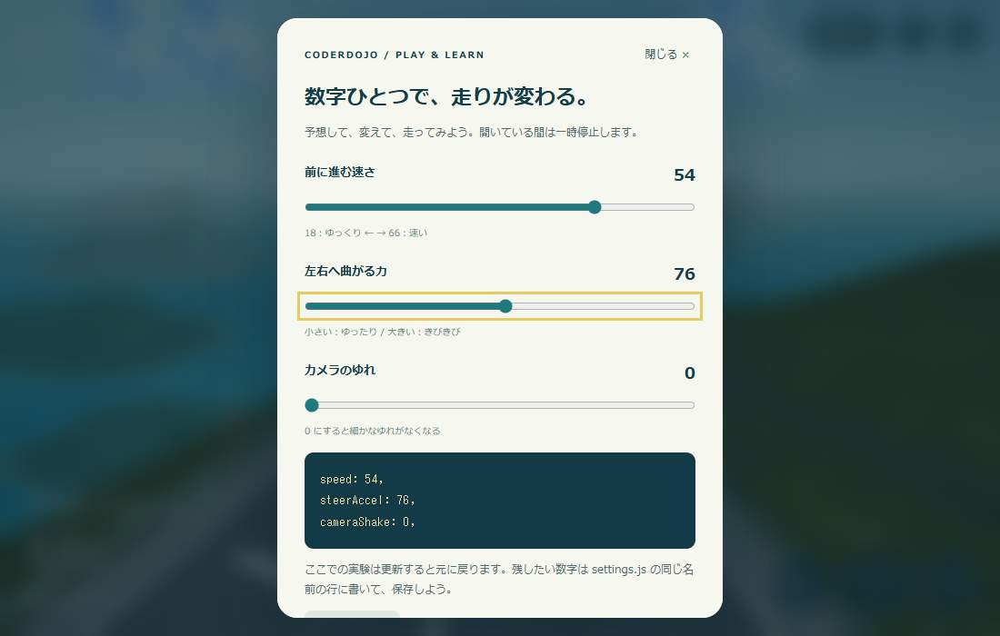

# 数字を変えて、自分だけの坂道にしよう 🛹

対象：文字入力とファイルの保存ができる人。JavaScriptをまだ知らなくても始められます。

[ゲームの説明へ戻る](../README.md) · [settings.js](../settings.js) · [動きの計算](../physics.js)

## 1. まず走ってみよう（5分）

← → で曲がり、↓ を押すとブレーキ。スマホなら画面下のボタンを長押しします。
景色を押したまま指を左右へ動かしても曲がれます。画面の中央付近へ戻すとまっすぐ進みます。

**今日の合言葉：予想する → ひとつ変える → 走る → 比べる。**

## 2. 速さを変えよう（10分）

最初はゲームの右上にある「改造ラボ」で、速さを `36 → 24` にして閉じてみましょう。
次に `54` を試します。どちらが曲がりやすいでしょう？

気に入った速さが決まったら、エディタで `settings.js` を開きます。

```js
speed: 36,
```

この **36だけ** を、例えば次のように書きかえます。

```js
speed: 24,
```

保存してブラウザを更新します。`speed` の文字、コロン `:`、最後のカンマ `,` はそのままです。
数字は半角で入力します。慣れるまでは18〜66の範囲で試しましょう。

> ラボは実験用です。ファイルは自動保存しません。ページを更新すると、`settings.js` に書いた数字へ戻ります。

| 変える前 | 変える後 | 予想 | 実際はどうだった？ |
|---|---|---|---|
| 36 | 24 | ゆっくりになる？ | 自分で記録しよう |
| 24 | 54 | 曲がるのが難しくなる？ | 自分で記録しよう |



## 3. どうして前に進むの？（10分）

パラパラ漫画のように、コンピューターは少しずつ違う絵を何度も描きます。
その1枚を「フレーム」と呼びます。

```text
① 押されているキーや指の位置を調べる
② 前の絵から何秒たったかを調べる
③ その時間ぶんだけ人を進める
④ 人の少し後ろへカメラを動かす
⑤ 新しい絵を描く
   → ①へ戻る
```

動きの中心になる考え方は、これです。

```js
進む距離 = 速さ * 経過した秒数
```

例：速さが36で、前の絵から `1 / 60` 秒たっていたら、`36 × 1 / 60 = 0.6` だけ進みます。
30枚/秒で描くPCなら、1枚ごとに `36 × 1 / 30 = 1.2` 進みます。
**どちらも1秒で36進む**ので、PCごとに速さが変わりにくくなります。

実際のゲームでは、発進時に0から目標速度へ少しずつ加速します。計算は `physics.js` の `advance` にあります。
`state.distance` は「スタートから進んだ距離」、`state.currentSpeed` は「今の速さ」です。
`game.js` の `animate` は `requestAnimationFrame` で次の絵を予約します。

> この計算式は等速運動の説明です。実装では加速の途中も計算して距離を求めています。重いフレームは最大0.05秒として扱うため、極端に処理が遅いとゲームの時間もゆっくり進みます。

## 4. 曲がり方を変えよう（10分）

車のハンドルを急にいっぱいまで切ると、動きがカクッとします。
このゲームでは、キーや指の入力へ少しずつ近づけ、横移動と体の傾きを滑らかにしています。

| 設定の名前 | 最初の値 | まず試す値 | 変わること |
|---|---:|---:|---|
| `steerAccel` | 75 | 50 / 100 | 大きいほど左右へ動かす力が強くなる |
| `steerFriction` | 0.80 | 0.70 / 0.90 | 大きいほど横すべりが残る。0より大きく1より小さくする |
| `steerMax` | 9 | 5 / 12 | 横移動の最高速度。ただし力と摩擦により上限に届かないこともある |
| `steeringResponse` | 0.10 | 0.06 / 0.20 | 小さいほど操作へ早く反応する。0にはしない |
| `brakeFactor` | 0.38 | 0.25 / 0.60 | ブレーキ中の目標速度の倍率。0.25なら通常の25% |

左右入力は左が `-1`、中央が `0`、右が `1`。指の位置なら `0.4` など、その間の数字にもできます。
`state.xVel` は横へ滑る速さ、`state.xOffset` は道路の真ん中からどれだけ横にいるかです。
道の端では外向きの動きを弱め、最後に道幅の中へ位置を収めています。

**チャレンジ：手を離したときに、すぐ止まるスケボーを作ろう。**

## 5. 景色とカメラを変えよう（10分）

| 名前 | 最初の値 | 試してみよう |
|---|---:|---|
| `riderLean` | 0.32 | `0.2` と `0.4` で、曲がるときの体の傾きを比べる |
| `cameraShake` | 0 | 標準は振動なし。`0.008` で細かな振動を試せる |
| `cameraHeight` | 4.6 | `6` にすると高い場所から見おろす |
| `cameraBack` | 8.5 | `11` にすると人から離れて見る |
| `cameraLookAhead` | 26 | `20` と `32` で、先の道の見え方を比べる |
| `coastDrop` | 68 | `35` と `85` で、海側の斜面の深さを比べる |
| `lapSpeedGain` | 0.08 | `0` にすると、何周しても同じ速さ |

- 道は短い点列をつないで作ります。`sampleAt` が「この距離の道の位置と向き」を調べます。
- 海は大きな平面です。色と光の模様を時間とともに変えて、波を表現します。
- 島は高さの違う輪をつないだ立体。遠い島ほど淡い色にして奥行きを出します。
- 遠くの景色には霧を混ぜ、空と海へなじませます。
- 海岸は海面より少し高い陸と、海中へ伸びる壁でつなぎます。同じ高さの面を重ねず、境目のちらつきを防ぎます。
- 人物は画像を貼った1枚の板を細かく分割し、足元を固定して上半身を曲げます。絵の透明度は変えないので、左右操作で体が点滅しません。
- カメラは人の後ろを追いかけます。急に飛ばず、目標へ少しずつ近づけます。

PCやスマホの「視差効果を減らす」設定では、カメラの傾き・速度による画角変化・風の線などを控えます。

> `jacketColor` / `boardColor` は画像を使わないときの代替3Dモデル用です。普段の人物画像の色は変わりません。画像を変える課題では [assetsの説明](../assets/README.md) を読んでください。

## 6. 自分のコースを作ろう（発展）

`settings.js` の下にある `COURSE` は、坂道の設計図です。

```js
{ curve: 0,   length: 48,  slope: 0.20 },
{ curve: 112, length: 190, slope: 0.25, bigCurve: true, photoCurve: true },
```

| 名前 | 意味 |
|---|---|
| `curve` | その区間全体で曲がる角度。プラスは右、マイナスは左、0は直線 |
| `length` | 区間の長さ。最初は2の倍数で、48以上の長さを使う |
| `slope` | 基本の下り勾配。0.20なら水平に10進むと2下がる |
| `bigCurve` | 大カーブの手前に標識と路面文字を置く |
| `photoCurve` | 最初の見せ場用の配置・カメラ演出を使う |

最初は `curve: 18` を `curve: 8` にするなど、小さい変更から試しましょう。
区間の境目は滑らかにつないでいます。さらに坂のうねりや港の平坦化を加えるため、`slope` の数字と実際の勾配は全区間で一致するわけではありません。

大きく短いカーブは、道路や斜面が重なることがあります。島・港・家には配置の決まりがあるので、コースを大きく変えたら最初からゴールまで確認しましょう。

## うまく動かないとき

- **数字を変えても同じ：** 保存したか、正しいフォルダのファイルかを確認して更新。ラボの数字も確認する。
- **画面が出ない：** 全角数字、カンマの消し忘れ・消しすぎ、括弧の不足を確認。まず直前の変更を戻す。
- **画像が出ない：** `file://` ではなくローカルサーバーから開く。READMEの起動手順を見る。
- **曲がりすぎる：** `steerAccel` を小さくする。または `steerFriction` を小さくする。
- **途中で勝手に止まる：** 別のタブに移ると自動停止します。「走りつづける」で再開する。
- **CDNの読み込みに失敗：** インターネット接続を確認する。

## メンターの方へ

45〜60分の目安：体験5分 → 速さ10分 → 動く原理10分 → 操作または景色10分 → 自由改造10分 → 発表5分。
「改造前の数字」「予想」「結果」の3つを記録してもらうと、試行錯誤を振り返れます。

実装を追う順番は `settings.js` → `physics.js / advance` → `game.js / animate` → `sampleAt`。
最初から3D描画全体を説明する必要はありません。

ラボはファイルの初期値を保持して「元の数字に戻す」で戻します。途中の実験結果は永続化しません。
ページを更新すると周回と走行位置も最初に戻ります。

計算は最大1/120秒ごとに更新し、入力・速度・カメラは経過時間に応じた補間を使います。ブレーキは目標速度を下げる方式です。勾配は景観とカメラ演出に使い、重力による速度変化は計算していません。

**発展課題：** 坂の勾配でも速さが変わるルールを考える、1周の時間を表示する、ゴール時に感想を出す。
`lives` や `obstacleDensity` の数値だけでは、旧版の衝突ゲームは復活しません。障害物生成・衝突判定・HUDを接続するコードが必要です。

GitHubへ掲載する教材はこのファイルとREADMEです。ゲームと一緒に `settings.js`、`physics.js`、`docs/` もリポジトリへ含めてください。
