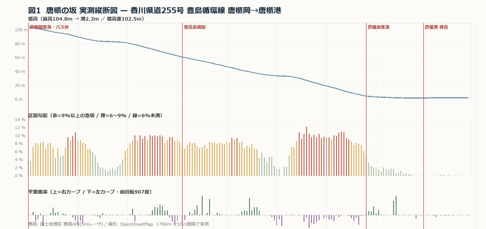
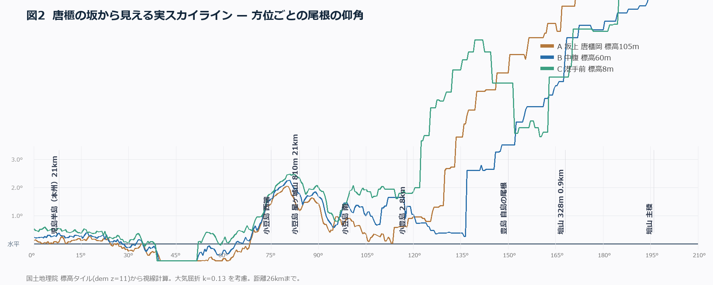
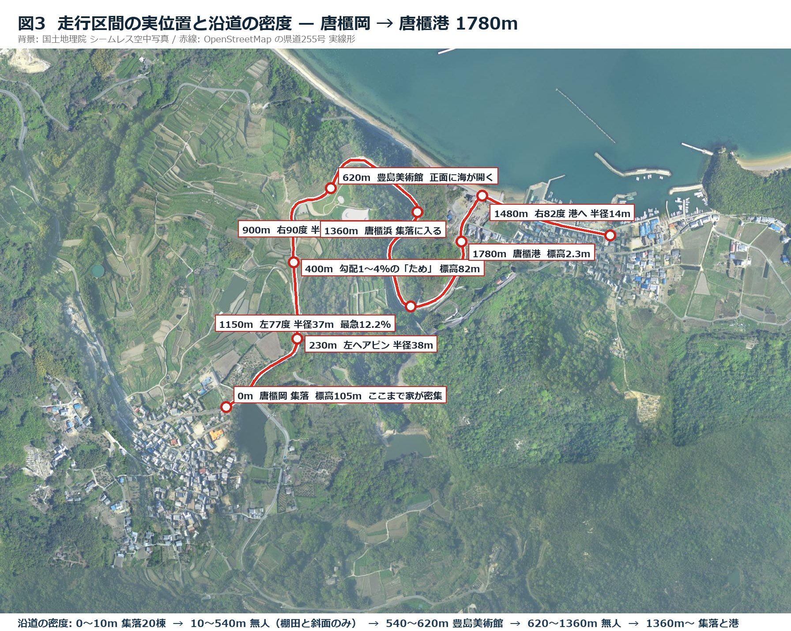

# 参照正本 — 唐櫃の坂

**豊島ダウンヒルの線形・景色・色を決める、ただ一つの基準。**

作成 2026-09-05 / 対象 `game.js`

---

## 0. この文書の使い方

これまで「豊島っぽくない」「没入感がいまいち」は感想として語られてきた。
この文書は、その議論を **実測値との差** に置きかえるために作った。

- 何かを直すときは、まずここの数字と現状を並べる。**印象で決めない。**
- 数字はすべて公的データからの実測で、`reference/tools/` のスクリプトで再現できる。
- ここに無い項目（草の色つや、瓦の質感など）は、第9章のショットリストで現地を見て決める。

**参照する実在の坂**

> 香川県道255号 豊島循環線
> 香川県小豆郡土庄町豊島唐櫃 — 唐櫃岡（標高105m）から 唐櫃港（標高2m）まで

---

## 1. 結論 — ゲームと実物のいちばん大きな差

| 項目 | 実測（唐櫃の坂） | ゲーム現行 | 差 |
|---|---|---|---|
| 走行距離 | 1,780 m | 1,268 ユニット | 1.4倍 短い |
| 標高差 | 102.5 m | 約300ユニット相当 | 3倍 落ちる |
| 平均勾配 | **5.7 %** | 24 %（うねりこみ最大42%） | **4〜7倍 急** |
| 最急勾配 | **12.2 %** | 約42 % | 3.4倍 |
| 総回転角 | **907 度** | 486 度 | **半分しか曲がっていない** |
| 最小カーブ半径 | **14 m** | 約97 m | 7倍 大きい |
| 車道幅 | **5.5 m**（港区間4.5m） | 9.6 ユニット | 1.7倍 広い |
| センターライン | 港区間は **無し** | 全線に破線 | 過剰 |
| 沿道の建物 | 集落 → **1,350m 無人** → 港町 | ほぼ全線に点在 | 密度の物語が無い |
| 中腹のランドマーク | **豊島美術館**（620m地点） | 無し | 目印が無い |
| 海の彩度 | 0.22 〜 0.27 | **1.00** | 3〜4倍 派手 |

**いまのゲームは「短くて、急すぎて、まっすぐで、広すぎる道」を走っている。**
実物は「長くて、ゆるやかで、ぐねぐね曲がる、狭い道」である。
ここを直すだけで、素材を1枚も足さずに豊島らしさは大きく戻る。

---

## 2. 実測縦断 — 標高と勾配



道なり1,780mを10m間隔、179点で実測した。

| | 値 |
|---|---|
| 起点 唐櫃岡 | 34.485793, 134.088140 / 標高 104.8 m |
| 終点 唐櫃港 | 34.489228, 134.097477 / 標高 2.3 m |
| 標高差 | 102.5 m |
| 平均勾配 | 5.7 % |
| 最急勾配 | 12.2 %（1,120m地点） |

### 勾配の構造 — これが「ため→どん」の正体

| 区間 | 勾配 | 性格 |
|---|---|---|
| 0 〜 200 m | 4 〜 10 % | 集落を抜けながら下りはじめる |
| 200 〜 280 m | 8 % | ヘアピンをはさんで下る |
| **280 〜 400 m** | **1 〜 4 %** | **ほぼ平ら。ここが「ため」** |
| 400 〜 520 m | 7 → 10 % | 一気に落ちる。**ここが「どん」** |
| 520 〜 1,000 m | 7 〜 9 % | 美術館の前を通って淡々と下る |
| 1,000 〜 1,030 m | 0 % | 一瞬平ら（左47度カーブと重なる） |
| **1,060 〜 1,250 m** | **9 〜 12.2 %** | **最急。集落へ向けて落ちる** |
| 1,420 m 〜 終点 | 0 〜 2 % | 港の平地。360mの水平区間 |

**重要**: 「ため」は1箇所ではなく2箇所ある（330m地点と1,010m地点）。
どちらも直後に急勾配が来る。ゲームの `slopeWave` による周期的なうねりは、
この構造を潰している。**うねりをやめて、実測プロファイルをそのまま使うこと。**

---

## 3. 実測平面 — カーブ

総回転角 **907度**（絶対値の累計）。いっぽう正味の方位変化はわずか **+42度**。
つまり **ほぼ同じ方角へ進みながら、900度ぶん曲がっている**。これが島の坂道の本質。

### 大カーブ一覧（実測）

| 位置 | 曲がり | 半径 | 標高 | 向き | 備考 |
|---|---|---|---|---|---|
| 200 〜 230 m | 45度 | 38 m | 90 → 87 m | 左 | 最初のヘアピン |
| 510 〜 610 m | 39度 | 145 m | 71 → 62 m | 右 | 美術館へ向かう大きな弧 |
| 680 〜 690 m | 18度 | 31 m | 56 m | 右 | 短く鋭い |
| **870 〜 940 m** | **90度** | **44 m** | 41 → 36 m | 右 | **直角に近い折り返し** |
| 1,000 〜 1,030 m | 47度 | 37 m | 34 m | 左 | 平坦部と重なる |
| **1,130 〜 1,180 m** | **77度** | **37 m** | 26 → 21 m | 左 | 最急勾配と重なる |
| 1,470 〜 1,490 m | 82度 | **14 m** | 3 → 2 m | 右 | 港へ入る。ほぼ直角 |

ゲームの最大カーブは半径97m。**実物のカーブは半分以下の半径で、数は倍ある。**
「高速道路のような大きな弧」をやめ、**きつく短いカーブを連ねる**こと。

### 実測から導いた COURSE 配列

`reference/tools/05_course.py` が実測プロファイルから自動生成した。**1ユニット = 1m** とする。

| 検算項目 | 実測 | この配列 |
|---|---|---|
| 総延長 | 1,780 m | 1,780 |
| 総回転角 | 907度 | **902度** |
| 正味の方位変化 | +42度 | **+44度** |
| 標高差 | 102.5 m | **102.1 m** |
| 最小カーブ半径 | 14 m | 10 m |
| 大カーブ（標識） | 7箇所 | **7箇所** |

> **なぜ57区間もあるのか。** 区間をまとめると総回転が落ちる。15区間まで減らすと
> 907度が587度、最小半径も49mまで鈍り、**いま直そうとしている「曲がらなさ」を再現してしまう。**
> ぐねぐね曲がることがこの坂の正体なので、区間数は削らない。
> 教材で書きかえるときは、1行ずつ好きに触ってよい（全部いじる必要はない）。

```js
const COURSE = [
  /* 香川県道255号 豊島循環線 唐櫃岡→唐櫃港 の実測線形。1ユニット=1m。
     標高104.8m→2.3m / 道なり1780m / 平均勾配5.7% 最急12.2% / 総回転907度
     bigCurve は実測の大カーブ7箇所の入口。出典と根拠は 参照正本_唐櫃の坂.md */
  { curve:     6, length:   30, slope:  0.049 },  // 唐櫃岡の集落を抜ける
  { curve:   -18, length:   20, slope:  0.079 },
  { curve:     2, length:   10, slope:  0.082 },
  { curve:   -19, length:   10, slope:  0.084 },
  { curve:     3, length:   30, slope:  0.076 },
  { curve:    13, length:   10, slope:  0.068 },
  { curve:     9, length:   20, slope:  0.056 },
  { curve:     4, length:   30, slope:  0.056 },
  { curve:   -15, length:   40, slope:  0.098 },
  { curve:   -20, length:   10, slope:  0.086, bigCurve: true },
  { curve:   -25, length:   20, slope:  0.085 },
  { curve:    -8, length:   70, slope:  0.053 },
  { curve:     3, length:   90, slope:  0.020 },  // ★ため（ほぼ平ら）
  { curve:     1, length:   30, slope:  0.070 },
  { curve:    11, length:   10, slope:  0.088 },
  { curve:   -12, length:   10, slope:  0.100 },
  { curve:     9, length:   70, slope:  0.095 },  // ★どん（一気に落ちる）
  { curve:    29, length:   20, slope:  0.099, bigCurve: true },
  { curve:    35, length:   20, slope:  0.099 },
  { curve:    16, length:   20, slope:  0.085 },
  { curve:    -4, length:   10, slope:  0.096 },
  { curve:   -36, length:   30, slope:  0.091 },
  { curve:    -0, length:   10, slope:  0.084 },
  { curve:   -23, length:   20, slope:  0.070 },  // 豊島美術館・海が開く
  { curve:    17, length:   40, slope:  0.081 },
  { curve:    18, length:   10, slope:  0.073, bigCurve: true },
  { curve:     1, length:   10, slope:  0.069 },
  { curve:    35, length:   10, slope:  0.071 },
  { curve:     3, length:   20, slope:  0.072 },
  { curve:    29, length:   10, slope:  0.084 },
  { curve:     6, length:  120, slope:  0.084 },
  { curve:    21, length:   30, slope:  0.075, bigCurve: true },
  { curve:    31, length:   10, slope:  0.071 },
  { curve:     9, length:   10, slope:  0.078 },  // 右90度 半径44m
  { curve:    36, length:   30, slope:  0.059 },
  { curve:   -13, length:   60, slope:  0.042 },
  { curve:   -19, length:   10, slope:  0.016, bigCurve: true },
  { curve:    -8, length:   10, slope:  0.016 },  // ★2度目のため
  { curve:   -20, length:   10, slope: -0.006 },
  { curve:    -0, length:   60, slope:  0.053 },
  { curve:    -0, length:   20, slope:  0.100 },
  { curve:   -17, length:   20, slope:  0.113 },
  { curve:   -23, length:   10, slope:  0.104, bigCurve: true },
  { curve:   -53, length:   40, slope:  0.100 },  // 最急12.2%
  { curve:     0, length:   10, slope:  0.094 },
  { curve:   -36, length:   50, slope:  0.096 },
  { curve:   -27, length:   90, slope:  0.094 },
  { curve:   -17, length:   10, slope:  0.079 },
  { curve:    -2, length:   20, slope:  0.069 },
  { curve:    16, length:   30, slope:  0.035 },  // 唐櫃浜の集落に入る
  { curve:    16, length:   10, slope:  0.020 },
  { curve:    12, length:   20, slope:  0.017 },
  { curve:     0, length:   50, slope:  0.015 },
  { curve:    26, length:   10, slope:  0.016, bigCurve: true },
  { curve:    56, length:   10, slope:  0.006 },  // 港へ入る右82度
  { curve:    -7, length:   80, slope:  0.002 },
  { curve:    -7, length:  210, slope: -0.001 },  // 唐櫃港 待合所
];  // 合計 1780 ユニット / 総回転 904度
```

あわせて変える定数:

```js
roadWidth: 5.5,     // 実測5.5m（現行9.6は広すぎ）
slopeWave: 0,       // 周期的なうねりは廃止。COURSEのslopeが実測なので不要
slopeRate: 0.057,   // 平均勾配（slope省略時の既定値）
```

> **教材としての注意**: CoderDojoで速さが物足りなくなったら、勾配ではなく `CONFIG.speed` を上げる。
> 勾配をいじると、この文書の数字と全部合わなくなる。

---

## 4. 見える景色 — スカイライン



国土地理院の標高データから、坂の上・中腹・港手前の3地点で
**方位ごとに尾根がどの高さに見えるか** を計算した（大気屈折を考慮、26kmまで）。

| 方位 | 見えるもの | 距離 | 仰角 |
|---|---|---|---|
| 0 〜 30度 | 児島半島（本州・岡山） | 17 〜 25 km | 0.1 〜 0.35度 |
| 30 〜 60度 | **播磨灘の開けた海。陸は無い** | — | — |
| 65 〜 110度 | **小豆島**（星ヶ城山810mを含む） | 6 〜 22 km | 0.2 〜 **2.2度** |
| 110 〜 125度 | **小豊島** | 2.8 km | 1.5度 |
| 130度 〜 | 豊島自身の尾根・壇山（328m, 0.9km） | 近景 | 3 〜 10度 |

### ここから決まること

1. **水平線は開いていない。** 東から東南東（方位65〜125度）は小豆島と小豊島でふさがれている。
   ゲームの「どこまでも続く外洋」は誤り。
2. **島は重なって見える。** 手前に小豊島（2.8km・濃い）、その奥に小豆島（6〜22km・薄い）。
   遠景レイヤーは **距離の違う2枚以上** で作る。1枚の帯では瀬戸内にならない。
3. **小豆島は大きい。** 仰角2.2度は画角62度の画面で **高さの約3.5%**。
   細い帯ではなく、はっきりした塊として描く。
4. **北にも陸がある。** 方位0〜30度に本州が20km先でうっすら見える。ここを空にしない。
5. **壇山は背後。** 方位243度・1.55km・仰角10度。走行中は **ほぼ真後ろ** で正面に出ない。
   「右手に山」は誤り。右手にあるのは山ではなく **切土の斜面と棚田**。

生データは `reference/data/skyline.json`（0.5度刻み、720点 × 3地点）。

---

## 5. 沿道の密度 — 島を下りてきた物語



| 区間 | 中身 |
|---|---|
| 0 〜 10 m | **唐櫃岡の集落**。120m以内に20棟、バス停「唐櫃岡集会所前」、てしま自然の家 |
| 10 〜 540 m | **無人**。棚田と斜面だけ。260m地点に春田川 |
| 540 〜 620 m | **豊島美術館**。駐車場・チケット売場・トイレ・カフェ・美術館本体 |
| 620 〜 1,360 m | **無人**。ふたたび棚田と森 |
| 1,360 m 〜 | **唐櫃浜の集落**。ここから終点まで50棟以上が連続 |
| 1,590 m | 小豆島豊島フェリー 唐櫃港 チケット売り場 |
| 1,680 m | フェリー到着所・岸壁・防波堤 |

**1,350mにわたって家が一軒も無い区間がある。** これが島の坂道の骨格であり、
港に着いたときの「人里に降りてきた」感を作っている。
いまのゲームは全線に民家が点在していて、この落差が消えている。

**豊島美術館は中腹の唯一のランドマーク**（走行の35%地点）。
白いコンクリートの殻が棚田の斜面に伏せている。ゲームには目印が一つも無いので、
ここに何か置くだけで「どこを走っているか」が生まれる。

沿道の芸術作品（瀬戸内国際芸術祭）: ささやきの森、Particles in the Air、
Your First Colour、No.29、No one wins – Multibasket。

---

## 6. 色 — 実測パレット

国土地理院のシームレス空中写真（正射画像・約1m/px）から中央値で採取した。

| 用途 | HEX | 彩度 | 明度 |
|---|---|---|---|
| 棚田（上部・草地） | `#99a498` | 0.06 | 0.62 |
| 棚田（中腹・耕作地） | `#809391` | 0.08 | 0.54 |
| 棚田の畦（土手） | `#76927f` | 0.11 | 0.52 |
| 照葉樹林（南斜面） | `#6f8b7d` | 0.11 | 0.49 |
| 海面（港内） | `#518089` | 0.26 | 0.43 |
| 海面（沖・唐櫃湾） | `#5c8790` | 0.22 | 0.46 |
| 瓦屋根（唐櫃浜） | `#7d909f` | 0.15 | 0.56 |
| 瓦屋根（唐櫃岡） | `#c2c9b9` | 0.13 | 0.76 |
| 道路舗装 | `#919d95` | 0.06 | 0.59 |
| 防波堤・護岸 | `#53838f` | 0.27 | 0.44 |

**この値をそのまま塗ってはいけない。** 上空からの撮影なので大気のかすみで彩度が落ちており、
地上で見る色より地味に出る。使い方は次のとおり。

- **絶対値ではなく比として使う。** 海は草地より彩度が高い、林は棚田より暗い、という序列を守る。
- **ゲームの海 `#1ec8ff` は彩度1.00。実測は0.22〜0.27。** かすみを差し引いても3〜4倍派手。
  最優先で下げる。目標は彩度0.45〜0.60、色相はシアンではなく **青緑（ティール）寄り**。
- **緑を黄緑にしない。** 実測はすべてオリーブから青緑側。現行の `#7ac943`（彩度0.55の黄緑）は
  日本の島の植生ではない。
- **瓦は青灰色。** `#7d909f` 系。いぶし瓦の色であって、茶色や黄色の木造ではない。

---

## 7. ゲームへの落とし込み — 優先順位

**素材を足す前にやること。第3優先までは全部コードだけで完結する。**

### 第1優先 — 骨格（これだけで印象が変わる）

1. `COURSE` を第3章の実測配列に差し替える。`slopeWave` を 0 にする。
2. `roadWidth` を 9.6 → 5.5 にする。
3. 港区間（1,420m以降）の **センターラインを消す**。
4. `cameraHeight` を 3.45 → 2.2前後に下げる。いまはドローン視点。

### 第2優先 — 土台（没入感の下地）

5. **影を出す。** `renderer.shadowMap.enabled = true`。最低でも人物の足元の楕円影。
   切り抜き素材が宙に浮いて見える原因はこれ。
6. トーンマッピングを入れる（`ACESFilmicToneMapping`）。
7. 海の彩度を第6章の目標まで落とす。霞を強め、空の水平線と色を合わせる。
8. 遠景を **2層以上** にする。手前=小豊島（2.8km・濃い）、奥=小豆島（6〜22km・薄い）。
   方位0〜30度にも本州の薄い層を置く。

### 第3優先 — 豊島の型

9. **棚田。** 道の左下に、等高線に沿った段々の石垣と平場を並べる。斜面一面が棚田。
10. **右手は山ではなく切土。** コンクリート擁壁と石積み。壇山は背後なので正面に描かない。
11. **密度の物語。** 0〜10m集落 → 1,350m無人 → 1,360mから集落。中間に家を置かない。
12. **豊島美術館を620m地点に置く。** 白い低い殻。中腹唯一の目印。
13. 民家を瓦屋根＋焼杉の板壁＋白漆喰＋石垣の土台に。いまの山小屋を差し替える。

### 第4優先 — 動きと音

14. 近景のパララックス。側溝、擁壁の継ぎ目、5m間隔の路面の目地。
15. 空を流れるスジは消す（流れ星に見えて逆効果）。
16. セミの声、沖の船。夏の豊島の音。

### 受け入れ基準

各項目のあと、第9章のショットリストの同じ地点の写真と **並べて比べる**。
「写真とゲームのスクリーンショットを横に置いて、同じ場所だと分かるか」が合格ライン。

---

## 8. 基準ショット — この一枚に合わせる

**実測 490m地点・進行方位358度・標高約73m。豊島美術館の手前、坂が丘の向こうへ消える所。**

[ストリートビューで開く](https://www.google.com/maps/@?api=1&map_action=pano&viewpoint=34.4894103,134.0897246&heading=358&pitch=0&fov=90)
（撮影 2013年6月・曇天。色ではなく**構図と要素**を基準にする）

この一枚が正本の中でいちばん重要。ゲームの同じ地点と並べて、違いを潰していく。

### 画面に写っているもの

| 位置 | 何があるか |
|---|---|
| 画面の上半分以上 | **空**。海より空のほうがずっと広い |
| 中央の細い帯 | **海**。画面の高さの1割ほどしかない。決して広くない |
| 水平線 | 対岸の島影がごく薄く、低く重なる。仰角2度以下 |
| 正面 | **道が丘の向こうへ消える**。この先がどこへ行くか見えない |
| 路面 | 白い減速マークと矢印。**センターラインは無い** |
| 左 | 樹木におおわれた岬が海へ落ちる。地面が**下へ落ちていく** |
| 右 | **駐車場と白いワゴン数台**、低いコンクリート擁壁、枯れ草 |
| 両側 | **ガードレールが道のすぐ際**。低くて白っぽい |
| 道ばた | 背の低い雑草と灌木がガードレールに接している |

### ゲームの現状との差（実験時に確認）

- **道が消えない。** ゲームは先まで見通せる。ここは凸の頂点にして道を隠す
- **右が緑の大きな山になっている。** 実物は駐車場と擁壁で、山は無い
- **左が平らな緑。** 実物は下へ落ちて、その先に岬と海が見える
- **緑が多すぎる。** 実物の近景は舗装・ガードレール・枯れ草・低木で、鮮やかな緑は少ない

---

## 9. ショットリスト — 現地確認用

実測線形から座標と進行方位を計算した。リンクを開くと、坂のその地点で
**その方角を向いた** ストリートビューが立ち上がる。

| # | 位置 | 標高 | 方位 | 見るもの | リンク |
|---|---|---|---|---|---|
| 01 | 0 m | 104.8 m | 59° | 唐櫃岡の集落を出る。家の密度、塀、石垣、電柱 | [開く](https://www.google.com/maps/@?api=1&map_action=pano&viewpoint=34.485793,134.088140&heading=59&pitch=0&fov=90) |
| 02 | 120 m | 95.9 m | 56° | 集落を抜けきった直後。棚田の始まり | [開く](https://www.google.com/maps/@?api=1&map_action=pano&viewpoint=34.486518,134.089064&heading=56&pitch=0&fov=90) |
| 03 | 230 m | 87.4 m | 1° | 左ヘアピン半径38m。ガードレールと山側の擁壁 | [開く](https://www.google.com/maps/@?api=1&map_action=pano&viewpoint=34.487165,134.089868&heading=1&pitch=0&fov=90) |
| 04 | 330 m | 83.2 m | 356° | 「ため」区間。勾配1〜4%、正面に何が見えるか | [開く](https://www.google.com/maps/@?api=1&map_action=pano&viewpoint=34.488064,134.089835&heading=356&pitch=0&fov=90) |
| 05 | 470 m | 75.3 m | 356° | 再び急坂へ。9%台に入る瞬間 | [開く](https://www.google.com/maps/@?api=1&map_action=pano&viewpoint=34.489322,134.089751&heading=356&pitch=0&fov=90) |
| 06 | 620 m | 約61 m | 30° | **豊島美術館。海が正面に開く最重要ショット** | [開く](https://www.google.com/maps/@?api=1&map_action=pano&viewpoint=34.490174,134.090688&heading=30&pitch=0&fov=90) |
| 07 | 620 m | 約61 m | 315° | 同地点から海側（左手）を向いた景色 | [開く](https://www.google.com/maps/@?api=1&map_action=pano&viewpoint=34.490174,134.090688&heading=315&pitch=0&fov=90) |
| 08 | 780 m | 48.8 m | 130° | 棚田の中を横切る。畦と石積みの高さ | [開く](https://www.google.com/maps/@?api=1&map_action=pano&viewpoint=34.490468,134.091936&heading=130&pitch=0&fov=90) |
| 09 | 900 m | 39.3 m | 191° | 右90度カーブ 半径44m | [開く](https://www.google.com/maps/@?api=1&map_action=pano&viewpoint=34.489701,134.092790&heading=191&pitch=0&fov=90) |
| 10 | 1,150 m | 24.4 m | 95° | 左77度、最急12.2%の区間 | [開く](https://www.google.com/maps/@?api=1&map_action=pano&viewpoint=34.487807,134.092621&heading=95&pitch=0&fov=90) |
| 11 | 1,360 m | 約7 m | 353° | 唐櫃浜の集落に入る。家並みの様式 | [開く](https://www.google.com/maps/@?api=1&map_action=pano&viewpoint=34.489105,134.093858&heading=353&pitch=0&fov=90) |
| 12 | 1,480 m | 2.3 m | 115° | 港へ入る右82度。センターラインが消える | [開く](https://www.google.com/maps/@?api=1&map_action=pano&viewpoint=34.490029,134.094368&heading=115&pitch=0&fov=90) |
| 13 | 1,700 m | 2.2 m | 101° | 唐櫃港。待合所、岸壁、フェリー | [開く](https://www.google.com/maps/@?api=1&map_action=pano&viewpoint=34.489370,134.096618&heading=101&pitch=0&fov=90) |
| 14 | 1,700 m | 2.2 m | 121° | 港から沖。小豊島と小豆島の重なり | [開く](https://www.google.com/maps/@?api=1&map_action=pano&viewpoint=34.489370,134.096618&heading=121&pitch=0&fov=90) |

> ストリートビューの写真は Google の著作物なので、**この場で見て判断するだけ**にし、
> スクリーンショットをリポジトリに入れない。色や配置のメモを本文に書き足すのが正しい残し方。

---

## 10. 出典と再現手順

| データ | 出典 | ライセンス |
|---|---|---|
| 道路線形・沿道の地物 | OpenStreetMap | ODbL |
| 標高（縦断・勾配） | 国土地理院 標高API（5mレーザ測量） | 国土地理院コンテンツ利用規約 |
| 標高（スカイライン計算） | 国土地理院 標高タイル `dem` z=11 | 同上 |
| 空中写真（図3・パレット） | 国土地理院 シームレス空中写真 z=17 | 同上 |

国土地理院のコンテンツを利用しています（出典の明示が条件）。

### 再現

```bash
cd reference/tools
py -3 00_osm_roads.py     # 道路線形を取得
py -3 01_route_profile.py # 標高を10m間隔で実測（約4分）
py -3 02_skyline.py       # スカイラインを計算
py -3 03_ortho.py         # 空中写真モザイクを作る
py -3 04_palette.py       # 実測パレットを採る
py -3 05_course.py        # COURSE配列を導出
py -3 06_figures.py       # 図1・図2
py -3 07_corridor.py      # 図3
py -3 08_shotlist.py      # ショットリスト
```

必要なもの: Python 3、Pillow、numpy。
外部APIを叩くので、失敗したら時間を置いて再実行する（レート制限がある）。

生データは `reference/data/` に置いてある。スクリプトを走らせなくても、
JSONを読めば全部の数字が取り出せる。

---

## 11. まだ埋まっていない穴

正直に書いておく。この正本にも欠けがある。

- **棚田の正確な範囲が無い。** OpenStreetMapに唐櫃の棚田が登録されていない。
  空中写真（図3）では斜面一面に段々が写っているので、位置は図から読み取るしかない。
- **色は上空からの値。** 地上の色ではない。第6章の注意書きのとおり、比としてしか使えない。
  ショットリストで地上の色を確認して、この表を更新するのが次の一手。
- **ガードレール・擁壁・側溝の寸法が未計測。** ショットリスト03と10で見て決める。
- **季節が不明。** 空中写真は田に水が無く、草も枯れ気味。夏の豊島とは違う。
  ゲームは夏なので、緑はこの実測値より濃く・鮮やかでよい（ただし黄緑にはしない）。

---

## 12. 実装してわかった制約（2026-09-05 実験）

第3章の COURSE を実際に `game.js` へ入れて走らせた。**坂の形は狙いどおりになったが、地形の描画が壊れた。**
実験版は `reference/game.js.measured-experiment` に残してある（本体は元に戻した）。

### 何が起きたか

道の左右の地形が `buildRibbon` / `buildSlopedRibbon` による **経路追従の帯** で作られている。
帯は道の中心から左右へ最大 **70ユニット** 伸びる。

- **帯は、曲がりの半径より外に頂点を置くと裏返る。** 現行コースの最小半径は137なので今までは無事だった
- 実測の唐櫃の坂は**最小半径14m**。0.7倍で10ユニット。帯の幅70に対して7分の1しかない
- 結果、内側の帯が道の上に折り返し、**画面いっぱいの濃緑の楔**になる

### もうひとつ、折り返しの問題

実測の道は**自分自身に折り返す**（図3の中央のループ）。
山や家は「道の右へ○○ユニット」という**経路ローカル座標**で置かれているため、
ある地点の右に置いた山が、別の区間の**真上**に落ちる。
経路ローカルでの配置は、折り返す道では成立しない。

### 試した回避と、その限界

エンジンを触らずに曲率を丸めると、こうなる。

| 許容最小半径 | 総回転 | 実測比 | 判定 |
|---|---|---|---|
| 80ユニット（無改造で安全） | 581度 | 64 % | 進行方位が実測+42度から-28度へ反転。**不可** |
| 60 | 719度 | 79 % | 方位まだ狂う |
| 45（帯を24ユニットへ縮小） | 810度 | 89 % | **試した。楔は減ったが残る** |
| 35 | 886度 | 98 % | 帯をさらに縮小しないと不可 |

R=45 まで丸め、地形帯を70→24ユニットへ狭めても、まだ折り返し区間で楔が出た。

### 結論 — 順番が逆だった

**COURSE の差し替えは、地形の作り方を変えたあとでないと入らない。**
第7章の第1優先を、次のとおり訂正する。

1. **地形を経路追従の帯から、ワールド座標の地形メッシュへ変える。** これが前提条件。
   道だけを帯で作り、その外は道の形と無関係な地形にする。折り返しても破綻しない
2. そのうえで COURSE を実測へ差し替える
3. 道幅・カメラ高さ・センターラインは、1と2のあとでよい

**先に安全に効くのは第2優先（影・トーンマッピング・海の彩度・遠景2層）のほう。**
こちらは地形の作り方に触らないので、いま入れられる。

### ついでに見つかった落とし穴

`index.html` の `gameScript.src` にバージョン文字列が手書きされている。

```js
gameScript.src = 'game.js?v=20260905-restored';
```

**ここを更新しないと `game.js` を書きかえてもブラウザが古いコードを読み続ける。**
ハード再読込でも効かない。実験中に2回ここで時間を取られた。
